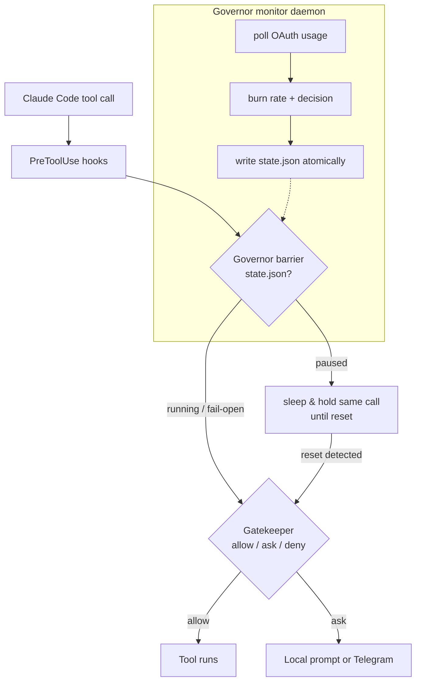

# gatekeeper-suite

> Two independent guards for [Claude Code](https://code.claude.com): one decides **whether** a tool
> should run, the other decides **when** — pausing before you hit your usage limit and resuming after reset.

[](LICENSE)


## What is it

A suite of two PreToolUse-based guards for Claude Code, usable together or separately:

- **Gatekeeper** — a permission guardian. Intercepts tool calls and returns *allow / ask / deny*
  using a configurable chain of LLM backends, with an autonomous mode, remote approval over
  Telegram, and in-chat commands (`gk status`, `gk auto on`).
- **Governor** — a usage-limit monitor. Watches your account's rolling usage window and, before it
  reaches 100%, **pauses all tools** by holding the current call inside the hook, then **resumes
  automatically** after the limit resets — no lost context, no model calls, no `/compact`.

Both are **fail-open**: any error in a guard releases the tool. A guard bug must never trap your session.

## Features

- **Governor**
  - Preemptive pause by usage threshold *and* by predicted time-to-100% (burn rate).
  - Universal barrier (matcher `*`) covering every tool — main agent and subagents.
  - Holds the *same* pending call and releases it after reset (no re-prompt, no model summary).
  - Atomic, versioned state machine; single-instance background monitor daemon.
  - Assisted fallback: if the hook can't outlast the reset, you get a ready `claude --resume <id>`.
  - Optional remote notifications (pause / resume / recovery) over Telegram.
- **Gatekeeper**
  - Ordered LLM backend chain (Gemini, Cerebras, OpenRouter, custom, Ollama, headless `claude -p`).
  - Autonomous mode per session; deny-with-alternative; remote authenticated ask (nonce, chat allowlist).
  - `gk status` panel: active backend, 5h/7d usage %, reset time, autonomous state.
- **Integration**: during a governor pause, the gatekeeper skips the only backend that consumes your
  account limit (`claude -p`), closing the loop.

## Architecture



The **barrier** never touches the network — it only reads a local `state.json` (microseconds).
The **daemon** is the only component that polls the usage endpoint, off the critical path.

## Quickstart

```bash
git clone https://github.com/gvom/gatekeeper-suite.git
cd gatekeeper-suite
python install.py                 # copies hooks, installs deps, merges settings.json safely
cp .env.example .env              # fill in your keys (all optional to start)
python gatekeeper/gatekeeper.py validate   # sanity check
```

Then in Claude Code, type `gk status` to see your current usage and backend.

## Autonomous mode & execution floors

Turn it on in chat with `gk auto on` (or `gk auto on <floor>`). While autonomous, any decision
that would normally be `ask`/`deny` goes through a **resolver** that decides — with no human:

- **approve** — the action is safe/aligned → allow.
- **rewrite** — an equivalent, safer alternative exists → either rewrite the Bash command
  *transparently* (via the hook's `updatedInput`, no extra model turn) or `deny` with the
  alternative so the model self-corrects. Every rewrite is **re-validated** by the static risk
  classifier before it can run.
- **stop** — genuinely dangerous/irreversible with no safe alternative → `deny`.

A **deterministic floor** hard-stops the non-negotiable categories *before* the resolver runs.
Low/medium routine actions take the classic fast path (allow, no LLM). If the resolver is
unavailable it **fails safe** back to `ask`. Type `gk help` any time.

**Execution floors** (`gk floor <name>`, or `GATEKEEPER_AUTO_FLOOR`; default **`strict`**):

| Category | `strict` (default) | `balanced` | `open` |
|---|:---:|:---:|:---:|
| Exfiltration (outbound network/data egress) | 🛑 stop | 🛑 stop | resolver |
| Destruction **outside** the project (`rm -rf ~`, `/`, abs. paths) | 🛑 stop | 🛑 stop | resolver |
| `sudo` / system changes / dangerous PowerShell | 🛑 stop | resolver | resolver |
| Secrets (`.env`, credentials) | 🛑 stop | resolver | resolver |
| Non-parseable command (not statically verifiable) | 🛑 stop | resolver | resolver |
| `eval`/`exec`, obfuscation, pipe-to-shell (in project) | resolver | resolver | resolver |
| `rm` **inside** the project | resolver | resolver | resolver |

- **`strict`** — resolves routine work; stops on exfiltration, secrets, sudo/system and
  destruction outside the project.
- **`balanced`** — resolves more; stops only on exfiltration and destruction outside the project.
- **`open`** — resolves everything, no deterministic floor. Use consciously.

Aliases accepted: `1/2/3`, `safe`→`strict`, `yolo`/`unsafe`→`open`. Any unset/invalid value
falls back to **`strict`**.

## Documentation

- [docs/INSTALL.md](docs/INSTALL.md) — install, verify, uninstall
- [docs/CONFIGURATION.md](docs/CONFIGURATION.md) — every environment variable
- [docs/ARCHITECTURE.md](docs/ARCHITECTURE.md) — decision chain & barrier internals
- [docs/SECURITY.md](docs/SECURITY.md) — threat model, fail-open, the internal-endpoint disclaimer

## License & credits

MIT © 2026 Gabriel Meneses. The Governor's OAuth usage-reading method is adapted from
[jens-duttke/usage-monitor-for-claude](https://github.com/jens-duttke/usage-monitor-for-claude) (MIT) —
see [NOTICE](NOTICE).

> ⚠️ The Governor uses an **internal, undocumented** Claude Code endpoint (`/api/oauth/usage`). It may
> change or be blocked at any time. Fail-open ensures tools keep working if it breaks. Use at your own risk.
